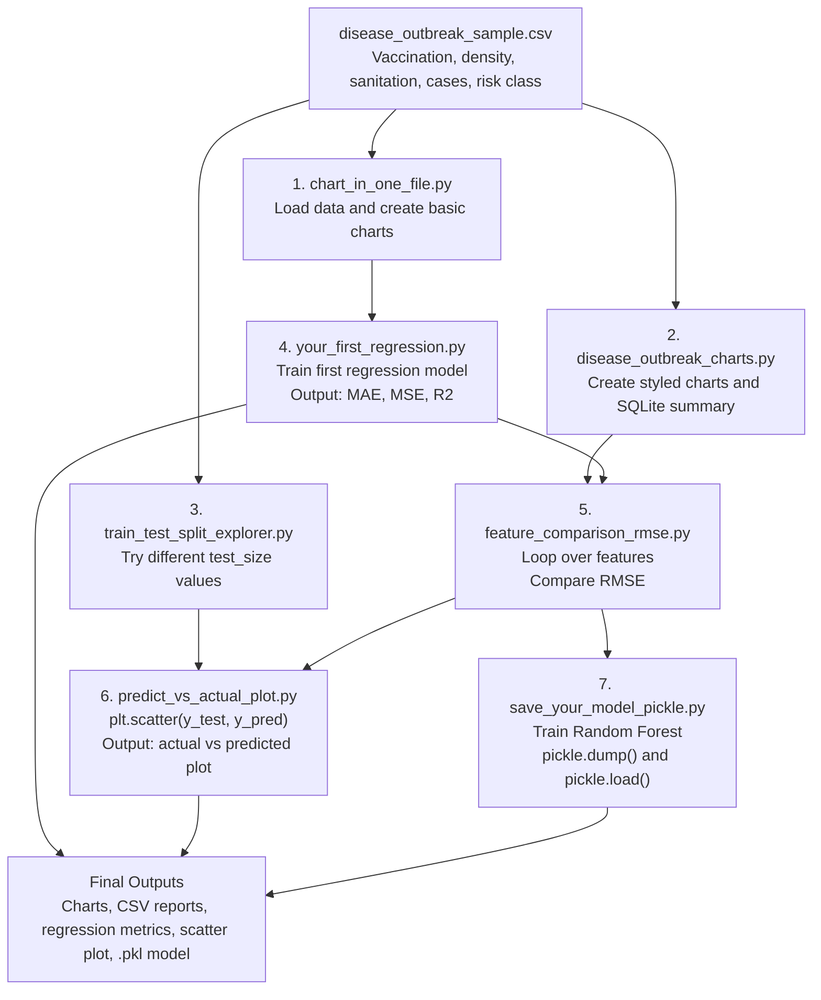

# Day 4 Disease Outbreak Code Flowchart

```mermaid
flowchart TD
    A["disease_outbreak_sample.csv<br/>Vaccination, density, sanitation, cases, risk class"]

    B["1. chart_in_one_file.py<br/>Load data and create basic charts"]
    C["2. disease_outbreak_charts.py<br/>Create styled charts and SQLite summary"]
    D["3. train_test_split_explorer.py<br/>Try different test_size values"]

    E["4. your_first_regression.py<br/>Train first regression model<br/>Output: MAE, MSE, R2"]
    F["5. feature_comparison_rmse.py<br/>Loop over features<br/>Compare RMSE"]
    G["6. predict_vs_actual_plot.py<br/>plt.scatter(y_test, y_pred)<br/>Output: actual vs predicted plot"]

    H["7. save_your_model_pickle.py<br/>Train Random Forest<br/>pickle.dump() and pickle.load()"]
    I["Final Outputs<br/>Charts, CSV reports, regression metrics, scatter plot, .pkl model"]

    A --> B
    A --> C
    A --> D

    B --> E
    C --> F
    D --> G

    E --> F
    F --> G
    F --> H

    E --> I
    G --> I
    H --> I
```
